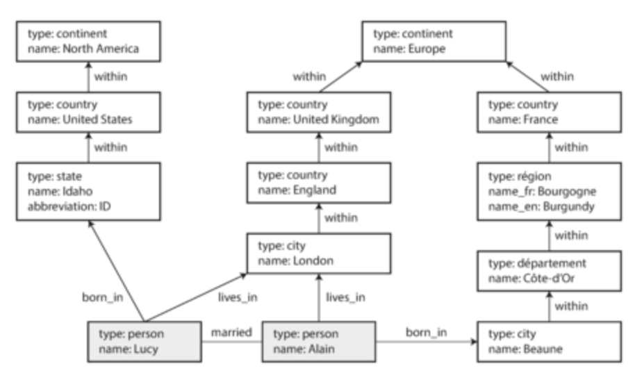

## Many-to-One and Many-to-Many Relationships
For a data structure like a résumé:
- **one-to-many** relationships from the user profile to the user’s positions, educational history, and contact information imply a tree structure in the data
- **Many-to-Many** one user can write a recommendation for another user
- **many-to-one** relationships many people live in one particular region, many people work in one particular industry

- Anything that is meaningful to humans may need to change sometime in the future—and if that information is duplicated, all the redundant copies need to be updated. That incurs write overheads, and risks inconsistencies (where some copies of the information are updated but others aren’t). Removing such duplication is the key idea behind normalization in databases
- many-to-one relationships (many people live in one particular region, many people work in one particular industry), don’t fit nicely into the document model. In relational databases, it’s normal to refer to rows in other tables by ID, because joins are easy. In document databases, joins are not needed for one-to-many tree structures, and support for joins is often weak

## Data Models
1. relational model
    - a relation (table) is simply a collection of tuples (rows), and that’s it
2. JSON/Document model
3. hierarchical model
    - It has some remarkable similarities to the JSON model used by document databases. It represented all data as a tree of records nested within records, much like the JSON
4. network/CODASYL model
    - In the tree structure of the hierarchical model, every record has exactly one parent; in the network model, a record could have multiple parents. For example, there could be one record for the "Greater Seattle Area" region, and every user who lived in that region could be linked to it. This allowed many-to-one and many-to-many relationships to be modeled.
5. 


## Relational Model Versus Document Model
**Storage locality:** A document is usually stored as a single continuous string . If data is split across multiple tables, multiple index lookups are required to retrieve it all, which may require more disk seeks and take more time.

1. SQL
    - **schema-on-write** is similar to static (compile-time) type checking
    - pros:
        - better support for joins, and many-to-one and many-to-many relationships
    - cons:
        - minutes or even hours of downtime when altering a large table
2. NoSQL
    - **Schema-on-read** is similar to dynamic (runtime) type checking in programming languages
    - pros:
        - A need for greater scalability than relational databases can easily achieve, including very large datasets or very high write throughput.
        - A widespread preference for free and open source software over commercial database products.
        - Frustration with the restrictiveness of relational schemas, and a desire for a more dynamic and expressive data model
        - schema flexibility
        - better performance due to locality
    - cons:
        - you cannot refer directly to a nested item within a document, but instead you need to say something like “the second item in the list of positions for user 251
        - The poor support for joins.many-to-many relationships may never be needed in an analytics application that uses a document database to record which events occurred at which time

## Query Languages for Data

**Imperative**: An imperative language tells the computer to perform certain operations in a certain order. You can imagine stepping through the code line by line, evaluating conditions, updating variables, and deciding whether to go around the loop one more time.
- very hard to parallelize

**Declarative**: In a declarative query language, like SQL or relational algebra, you just specify the pattern of the data you want—what conditions the results must meet, and how you want the data to be transformed (e.g. sorted, grouped, and aggregated)—but not how to achieve that goal
- parallel execution

## MapReduce Querying
MapReduce is a programming model for processing large amounts of data in bulk across many
machines, popularized by Google.MapReduce is neither a declarative query language nor a fully imperative query API, but somewhere in between

## Graph-Like Data Models
There are several different, but related, ways of structuring and querying data in graphs
- property graph model (implemented by Neo4j, Titan, and InfiniteGraph)
- triple-store model (implemented by Datomic, AllegroGraph, and others)

Declarative and Imperative graph query languages
|declarative                |imperative            |
|---------------------------|----------------------|
| Cypher                    | Gremlin              |
| SPARQL                    |frameworks like Pregel|
| Datalog                   | -                    |

## Property Graphs
In the property graph model, each vertex consists of:
- A unique identifier
- A set of outgoing edges
- A set of incoming edges
- A collection of properties (key-value pairs)

Each edge consists of:
- A unique identifier
- The vertex at which the edge starts (the tail(?) vertex) 
- The vertex at which the edge ends (the head(?) vertex)
- A label to describe the kind of relationship between the two vertices
- A collection of properties (key-value pairs)


Example of graph-structured data (boxes represent vertices, arrows represent edges).

You can think of a graph store as consisting of two relational tables, one for vertices and one for edges
```
-- postgres sql
CREATE TABLE vertices (
    vertex_id   integer PRIMARY KEY,
    properties  json
);

CREATE TABLE edges (
    edge_id     integer PRIMARY KEY,
    tail_vertex integer REFERENCES vertices (vertex_id),
    head_vertex integer REFERENCES vertices (vertex_id),
    label       text,
    properties  json
);

CREATE INDEX edges_tails ON edges (tail_vertex);
CREATE INDEX edges_heads ON edges (head_vertex);
```
In Cypher, :WITHIN*0.. ,it means “follow a WITHIN edge, zero or more times.

Cypher query to find people who emigrated from the US to Europe
```
MATCH
  (person) -[:BORN_IN]->  () -[:WITHIN*0..]-> (us:Location {name:'United States'}),
  (person) -[:LIVES_IN]-> () -[:WITHIN*0..]-> (eu:Location {name:'Europe'})
RETURN person.name
```
Find any vertex (call it person) that meets both of the following conditions:

1. person has an outgoing BORN_IN edge to some vertex. From that vertex, you can follow a chain of outgoing WITHIN edges until eventually you reach a vertex of type Location, whose name property is equal to "United States".

2. That same person vertex also has an outgoing LIVES_IN edge. Following that edge, and then a
chain of outgoing WITHIN edges, you eventually reach a vertex of type Location, whose name
property is equal to "Europe".

For each such person vertex, return the name property.

## Graph Queries in SQL
The same query (people who emigrated from the US to Europe), expressed in SQL using **recursive common table expressions**
 - > A recursive query is a query that refers to a recursive CTE. The recursive queries are useful in many situations such as querying hierarchical data like organizational structure, bill of materials, etc.
```
WITH RECURSIVE

  -- in_usa is the set of vertex IDs of all locations within the United States
  in_usa(vertex_id) AS (
      SELECT vertex_id FROM vertices WHERE properties->>'name' = 'United States' [1]
    UNION
      SELECT edges.tail_vertex FROM edges [2]
        JOIN in_usa ON edges.head_vertex = in_usa.vertex_id
        WHERE edges.label = 'within'
  ),

  -- in_europe is the set of vertex IDs of all locations within Europe
  in_europe(vertex_id) AS (
      SELECT vertex_id FROM vertices WHERE properties->>'name' = 'Europe' [3]
    UNION
      SELECT edges.tail_vertex FROM edges 
        JOIN in_europe ON edges.head_vertex = in_europe.vertex_id
        WHERE edges.label = 'within'
  ),

  -- born_in_usa is the set of vertex IDs of all people born in the US
  born_in_usa(vertex_id) AS ( [4]
    SELECT edges.tail_vertex FROM edges
      JOIN in_usa ON edges.head_vertex = in_usa.vertex_id
      WHERE edges.label = 'born_in'
  ),

  -- lives_in_europe is the set of vertex IDs of all people living in Europe
  lives_in_europe(vertex_id) AS ( [5]
    SELECT edges.tail_vertex FROM edges
      JOIN in_europe ON edges.head_vertex = in_europe.vertex_id
      WHERE edges.label = 'lives_in'
  )

SELECT vertices.properties->>'name'
FROM vertices
-- join to find those people who were both born in the US *and* live in Europe
JOIN born_in_usa     ON vertices.vertex_id = born_in_usa.vertex_id  [6]
JOIN lives_in_europe ON vertices.vertex_id = lives_in_europe.vertex_id;
```
1. First find the vertex whose name property has the value "United States", and make it the first element of the set of vertices in_usa.

2. Follow all incoming within edges from vertices in the set in_usa, and add them to the same
set, until all incoming within edges have been visited.

3. Do the same starting with the vertex whose name property has the value "Europe", and build up the set of vertices in_europe.

4. For each of the vertices in the set in_usa, follow incoming born_in edges to find people
who were born in some place within the United States.

5. Similarly, for each of the vertices in the set in_europe, follow incoming lives_in edges to find people who live in Europe.

6. Finally, intersect the set of people born in the USA with the set of people living in Europe, by joining them.

## Triple-Stores and SPARQL
In a triple-store, all information is stored in the form of very simple three-part statements:
(subject, predicate, object). For example, in the triple (Jim, likes, bananas), Jim is the subject, likes is the predicate (verb), and bananas is the object.

The subject of a triple is equivalent to a vertex in a graph. The object is one of two things:
1. A value in a primitive datatype, such as a string or a number. In that case, the predicate and object of the triple are equivalent to the key and value of a property on the subject vertex. For example, (lucy, age, 33) is like a vertex lucy with properties
{"age":33}.

2. Another vertex in the graph. In that case, the predicate is an edge in the graph, the subject is the tail vertex, and the object is the head vertex. For example, in (lucy, marriedTo, alain) the subject and object lucy and alain are both vertices, and the predicate marriedTo is the label of the edge that connects them.

**Turtle**: In computing, Terse RDF Triple Language (Turtle) is a syntax and file format for expressing data in the Resource Description Framework (RDF) data model.
```
@prefix : <urn:example:>.
_:lucy     a       :Person.
_:lucy     :name   "Lucy".
_:lucy     :bornIn _:idaho.
_:idaho    a       :Location.
_:idaho    :name   "Idaho".
_:idaho    :type   "state".
_:idaho    :within _:usa.
_:usa      a       :Location.
_:usa      :name   "United States".
_:usa      :type   "country".
_:usa      :within _:namerica.
_:namerica a       :Location.
_:namerica :name   "North America".
_:namerica :type   "continent".
```
Example 2-6. A subset of the data in Figure2-5.png , represented as Turtle triples
## The semantic web
RDF was intended as a mechanism for different websites to publish data in a consistent format, allowing data from different websites to be automatically combined into a web of data—a kind of internet-wide “database of everything.

## The RDF data model
RDF has a few quirks due to the fact that it is designed for internet-wide data exchange. The
subject, predicate, and object of a triple are often URIs.
```
<rdf:RDF xmlns="urn:example:"
    xmlns:rdf="http://www.w3.org/1999/02/22-rdf-syntax-ns#">

  <Location rdf:nodeID="idaho">
    <name>Idaho</name>
    <type>state</type>
    <within>
      <Location rdf:nodeID="usa">
        <name>United States</name>
        <type>country</type>
        <within>
          <Location rdf:nodeID="namerica">
            <name>North America</name>
            <type>continent</type>
          </Location>
        </within>
      </Location>
    </within>
  </Location>

  <Person rdf:nodeID="lucy">
    <name>Lucy</name>
    <bornIn rdf:nodeID="idaho"/>
  </Person>
</rdf:RDF>
```
Example 2-8. The data of Example 2-7, expressed using RDF/XML syntax

The URL <http://my-company.com/namespace> doesn’t necessarily need to resolve to anything—from RDF’s point of view, it is simply a namespace.

## The SPARQL query language
SPARQL is a query language for triple-stores using the RDF data model.

finding people who have moved from the US to Europe
```
PREFIX : <urn:example:>

SELECT ?personName WHERE {
  ?person :name ?personName.
  ?person :bornIn  / :within* / :name "United States".
  ?person :livesIn / :within* / :name "Europe".
}
```
Example 2-9. The same query as before, expressed in SPARQL

The structure is very similar. The following two expressions are equivalent (variables start with a question mark in SPARQL):

|(person) -[:BORN_IN]-> () -[:WITHIN*0..]-> (location)| Cypher|
|-----------------------------------------------------|-------|
|?person :bornIn / :within* ?location.                |SPARQL |

## Graph Databases Compared to the Network Model
Are graph databases the second coming of CODASYL in disguise? No.
1. In CODASYL, a database had a schema that specified which record type could be nested within which other record type. In a graph database, there is no such restriction: any vertex can have an edge to any other vertex. This gives much greater flexibility for applications to adapt to changing requirements.

2. In CODASYL, the only way to reach a particular record was to traverse one of the access paths to it. In a graph database, you can refer directly to any vertex by its unique ID, or you can use an index to find vertices with a particular value.

3. In CODASYL, the children of a record were an ordered set, so the database had to maintain that ordering (which had consequences for the storage layout) and applications that inserted new records into the database had to worry about the positions of the new records in these sets. In a graph database, vertices and edges are not ordered (you can only sort the results when making a query).

4. In CODASYL, all queries were imperative, difficult to write and easily broken by changes in the schema. In a graph database, you can write your traversal in imperative code if you want to, but most graph databases also support high-level, declarative query languages such as Cypher or SPARQL.

## The Foundation: Datalog
Datalog is a much older language than SPARQL or Cypher.it provides the foundation that later query languages build upon.

Datalog’s data model is similar to the triple-store model, generalized a bit. Instead of writing a triple as (subject, predicate, object), we write it as predicate(subject, object)
```
name(namerica, 'North America').
type(namerica, continent).

name(usa, 'United States').
type(usa, country).
within(usa, namerica).

name(idaho, 'Idaho').
type(idaho, state).
within(idaho, usa).

name(lucy, 'Lucy').
born_in(lucy, idaho).
```
Example 2-10. A subset of the data in Figure 2-5, represented as Datalog facts